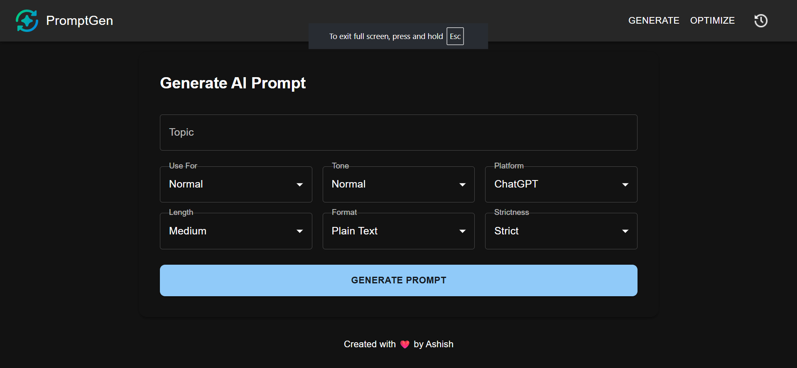

# PromptGen - AI Prompt Generator & Optimizer



This project is a full-stack application that allows users to generate, optimize, and manage AI prompts using popular AI providers (e.g., Gemini, GPT, Claude). It provides a modern frontend built with React + Material UI and a backend powered by FastAPI. Users can generate optimized prompts, view their history, and copy results easily.

## Features

- Generate Prompts – Create prompts for different purposes like Blog, Social Media, Code, etc.
- Optimize Prompts – Improve existing prompts with AI and get multiple variants with scores.
- History Management – Save prompt history in browser localStorage.
- Modern Dark UI – Built with React and Material UI for a sleek user experience.
- One-Click Copy – Copy any generated/optimized prompt with a single click.
- Fast Backend – Built using FastAPI with endpoints for generation & optimization.


## Tech Stacks

**Frontend:** React, Material UI, LocalStorage(For History)

**Backend:** Python, FastAPI, Unicorn

**Large Language Model:** Gemini/GPT/Claude


## Project Structure

```
📦 prompt-app
 ┣ 📂 prompt-frontend   # React app (Material UI)
 ┃ ┣ 📂 src
 ┃ ┃ ┣ 📂 components  # UI components (Generate, Optimize, History)
 ┃ ┃ ┣ App.jsx        # Main App
 ┃ ┃ ┗ index.jsx
 ┃ ┗ package.json
 ┣ 📂 prompt-backend    # FastAPI app
 ┃ ┣ main.py     # FastAPI routes
 ┃ ┣ requirements.txt
 ┣ README.md
```


## Setup & Installation

Backend Setup

```bash
cd prompt-backend
python -m venv venv
source venv/bin/activate   # On Windows: venv\Scripts\activate
pip install -r requirements.txt
uvicorn main:app --reload
```
Frontend Setup

```bash
cd prompt-frontend
npm install
npm run dev / start
```
## API Reference

#### Generate Prompt

```http
  POST /generate
```
```json
{
  "topic": "I want to make aws cloud price optimizer using ai so gives the free resources and step by step process implementation.",
  "mode": "text",
  "use_for": "Normal",
  "tone": "Professional",
  "platform": "ChatGPT",
  "format": "Plain Text",
  "length": "Large",
  "strictness": "Loose"
}
```

#### Optimize Prompt

```http
POST /optimize
```
```json
{
  "user_prompt": "Post for LinkedIn jha me web dev ke liye roadmap de sku",
  "num_variants": 2
}
```


## Future Improvements 
- Add authentication & user accounts

- Store history in database instead of localStorage

- Deploy to cloud (AWS/GCP/Render/Vercel)

- Advanced analytics (prompt effectiveness scoring)
- Add  Image and Video prompt generation
## Authors

- [@ashishalf](https://github.com/ashishalf)


## Contributing

Contributions are always welcome!

- Fork the repo

- Create a new branch (feature/your-feature)

- Commit changes

- Push & create a PR

## License

[MIT](https://choosealicense.com/licenses/mit/)

